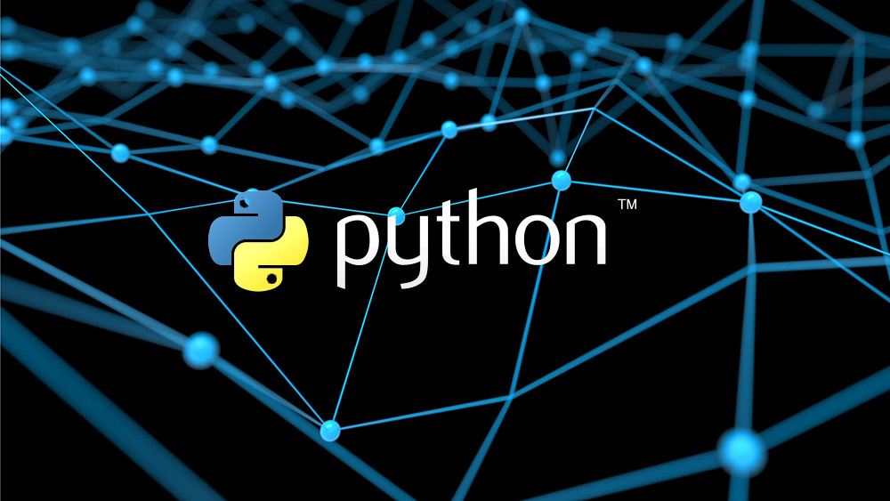
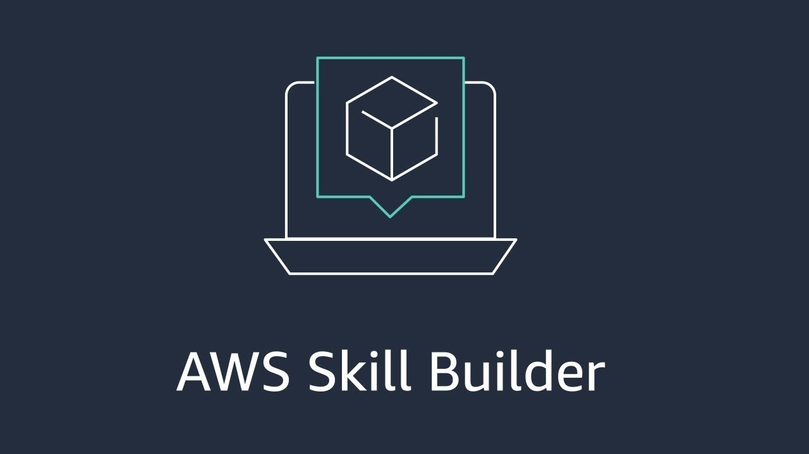

# Breno T. C. da S. Maeda

## Informações pessoais:

Olá, meu nome é Breno Maeda e estou no programa de bolsas da compass.uol!

Resido atualmente na cidade de [Ilha Solteira SP](https://www.google.com/maps/place/Ilha+Solteira+-+SP,+15385-000/@-20.480396,-51.5590673,10z/data=!3m1!4b1!4m6!3m5!1s0x9499f8719482b45b:0x2763c44fdc87bc75!8m2!3d-20.4322835!4d-51.3487707!16zL20vMDQwd3dj?entry=ttu), 60 km do município de Três Lagoas cidade em que estudo e falando nisso, estudo sistemas de informação na instituição [UFMS](https://www.ufms.br) e já estou no meu 10 período, e sim! já estourei na perspectiva de ter concluído em 8 semestres, ainda faltam 4 semestres totalizando 14 no final, mas não sou uma pessoa que vê o copo meio cheio, esse tempo a mais não foi perdido, conheci pessoas incriveis no processo e sou grato por isso. 

Sobre hobbies, começo pelos esportes, sou enxadrista amador, já disputei alguns torneios na minha região, chegando no máximo individualmente em segundo lugar no JESP(jogos escolares de São Paulo) sub 15 e entre os primeiros no sub 18, se quiser jogar ou ter umas aulinhas é só chamar!! Finjo que jogo outros esportes também kkkk, basket e futsal são os que me garanto não ser uma total ameba. Prático corridas curtas, gosto de ler(estava tentado bater a meta de 1 livro por mês, mas não vai dar não kkkk) e curto para um caramba terminar um programa sabendo que deu certo. 

Escolhi passar pelo programa para ter um noção básica do mercado de trabalho (sou muito inseguro em não ser um bom profissional no futuro). Ciente que sou uma pessoa que procrastina bastante, luto muito para melhorar isso, vim almejando receber o máximo de críticas possível para me auxiliar profissionalmente.

# Marco Atual && Desafios

- [x] Sprint 1                  *Sem Desafio*
- [x] Sprint 2                  [Desafio 2](https://github.com/Brenildu/maeda.compass/tree/main/Sprint_2/desafio)**link**
- [x] Sprint 3                  [Desafio 3](https://github.com/Brenildu/maeda.compass/tree/main/Sprint_3/desafio)**link**
- [x] Sprint 4                  [Desafio 4](https://github.com/Brenildu/maeda.compass/tree/main/Sprint_4/docker/desafio)**link**
- [x] Sprint 5                  *Sem Desafio*
- [x] Sprint 6                  [Desafiot](https://github.com/Brenildu/maeda.compass/tree/main/Sprint_6/AWS)**link**
- [ ] Sprint 7
- [ ] Sprint 8
- [ ] Sprint 9
- [ ] Sprint 10

# Certificados:
[Todos Certificados](https://github.com/Brenildu/maeda.compass/tree/main/Certificados)

# RESUMOS COMPLETOS
[Todos Resumos](https://github.com/Brenildu/maeda.compass/tree/main/Resumos)

## LINK PARA OS RESUMOS DO README:
### Sprint 1
1. [Curso Git e GitHub do básico ao avançado (c/ gist e GitHub Pages)](https://github.com/Brenildu/maeda.compass#curso-git-e-github-do-b%C3%A1sico-ao-avan%C3%A7ado-c-gist-e-github-pages)
2. [Curso Linux para Desenvolvedores (c/ terminal, Shell, Apache e +)](https://github.com/Brenildu/maeda.compass#curso-linux-para-desenvolvedores-c-terminal-shell-apache-e-)

### Sprint 2
3. [Curso SQL](https://github.com/Brenildu/maeda.compass#curso-sql)
4. [Curso Big Data](https://github.com/Brenildu/maeda.compass#curso-big-data)

### Sprint 3
5. [Curso Python 3 - Curso Completo do Básico ao Avançado](https://github.com/Brenildu/maeda.compass#curso-python-3---curso-completo-do-b%C3%A1sico-ao-avan%C3%A7ado)

### Sprint 4
6. [Curso Docker para Desenvolvedores(com Docker Swarm e Kubernetes) - Curso Completo do Básico ao Avançado](https://github.com/Brenildu/maeda.compass#curso-docker-para-desenvolvedorescom-docker-swarm-e-kubernetes---curso-completo-do-b%C3%A1sico-ao-avan%C3%A7ado)

### Sprint 5
7. [Curso AWS e preparação para Certificação Cloud Practitione](https://github.com/Brenildu/maeda.compass#curso-aws-e-prepara%C3%A7%C3%A3o-para-certifica%C3%A7%C3%A3o-cloud-practitione)

### Sprint 6
8. [Cursos AWS Partner e skills builderIntrodução na prática]()

# RESUMO DOS RESUMOS:

## Sprint 1

### Curso Git e GitHub do básico ao avançado (c/ gist e GitHub Pages)

&nbsp;

&nbsp;
* **Sobre o Git e GitHub**  

&nbsp;
Como desenvolvedor de softwares vejo claramente a importância do git e as frameworks que trabalham o utilizando, as modificações continuas, o uso de várias versões e a importância de trabalhar com a mesma versão nas máquinas de todos os membros do projeto é de suma importancia a medida que o projeto cresce e tudo isso se encaixa no tema do controle de versão que é a premissa principal do git.   
&nbsp;
O git é o sistema de controle de versão mais utilizado no mundo, ele cria e trabalha com repositórios, esses que são responsavéis de armazenarem todas as linhas de código de uma aplicação, quando falamos em trabalhar em um repositório estamos falando de trabalhar diretamente em uma aplicação. 
&nbsp;
Há diversas ferramentas que usam do git e armazenam repositórios em divesos servidores online, podemos citar 3 grandes plataformas que fornecem esse serviço: GitHub, GitLab e BitBucket. Elas possuem sim algumas diferenças, como o foco não é citar a melhor, a pior ou o defeito de cada uma, comentarei apenas sobre o GitHub. O GitHub é a plataforma mais popular que existe no setor, ela é uma ferramenta gratuita que possui uma gigantesca comunidade que compartilha códigos públicos e privados. Para se criar uma conta no GitHub é simples, basta pesquisar por GitHub no navegador, clicar na opção de criar nova conta, preencher o formulário e aceitar o email de confirmação, se tudo der certo você estará cadastrado e pronto para compartilhar repositórios com outras pessoas.  

&nbsp;
* **Por onde começar?**  

&nbsp;
Primeiro de tudo faça o download das ferramentas, sendo elas o <a href=https://git-scm.com/downloads>git</a> e um editor de texto. Download concluído é preciso criar uma pasta no editor de testo e abrir o terminal nela, com o comando git init é possível criar o repositório, tendo uma conta no GitHub será possível gerenciar esse repositório o enviando para lá com a sequência de comandos, git commit -m ".", git branch -M main, git remote add "link(que você receberá dentro do GitHub)" e git push -u Origin master. 
&nbsp;
Toda vez que criar pastas ou arquivos é preciso usar o comando git add ., toda modificação feita é preciso usar o comando git commit -a -m "mensagem tal" e para enviar para o repositório remoto é preciso dar um git push. Para baixar modificações se utiliza o comando git pull e é possível ver o status usando o git status.  

&nbsp;
* **Branch**

&nbsp;  
É importante se falar das branches, essas são as ramificações de um projeto, dentro de um projeto possivelmente haverá funçãos ou layouts que serão testados, para que possa ocorrer modificações diretas no projeto que não comprometam sua funcionalidade atual é usado uma ramificação, a ramificação principal é chamada de main e nela que há o projeto funcional(cuidado para não há modificar sem querer), qualquer outra ramificação não é vista para o usuário final.  
&nbsp;
Um bom exemplo de como utiliza-lás na prática de maneira saúdavel: imagine 3 desenvolvedores de um projeto web, um deles modificou a pasta css dentro de uma branch e enviou para o GitHub, outro modificou o arquivo index.html dentro de outra branch e também o enviou e o terceiro, sendo esse o responsável por alterar a main ele deu um push e gostou das modificações, apartir disso ele cópia com o código git merge as duas ramificações dentro da main. Apartir desse exemplo dá para ver que as ramificações podem ser utéis para que não hajá confusões nas modificações, se o primeiro dev precisasse fazer testes, esses teste ficariam apenas em sua ramificação.  

&nbsp;
* **Comandos principais**  
1. git init
    * Comando para criar um novo repositório, vai ser criado um pasta .git e um novo repo.
2. git add (+ . ou o nome do arquivo/pasta)
    * Comando que adiciona arquivos para o repositório
3. git commit (+-a  +-m +"especificações")    
    * Apenas usando commit já será comitada os arquivos, mais o -a e o -m vem como suporte para boas práticas comitando todos os arquivos e mando uma mensagem exclarecendo o commit.
4. git remote    
    * Faz a conexão entre seu repositório local e o GitHub.
5. git push
    * Sobe as modificações para o GitHub.
6. git pull
    * Baixa a ultima versão que foi dado o push do GitHub      
7. git branch
    1. (lista todas as ramificações)
    2. git branch (+ nome da branch): cria uma branch com esse nome
    3. git branch (+ nome da branch): deleta uma branch com esse nome
8. git checkout (+ nome da branch)
    * vai para a ramificação digitada, se usar o comando -b antes do nome, ele cria e vai para essa ramificação
9. git fetch
    * A partir desse comando, você irá receber todas as informações de commits, para avaliar, antes de aplicar essas alterações na sua versão local do repositório.    
10. git clone (+ link de um repositório original)
    * Comando para clonar um repostório já existente
11. git tag
    * Cria um marco dentro da branch, os marcos servem para ajudar no controle da versao: v 1.0
12. git rm (+ nome do arquivo)
    * Remove um arquivo    

&nbsp;
* **Readme.md e marckdown**

 
&nbsp;
O Readme é o que vai vender o seu peixe dentro do GitHub, a ideia é ter resumos principais da sua aplicação como o detalhamento da linguam utilizando, colaboradores, tarefas pendenter e concluídas e funcionalidades. 
&nbsp;
Para formatar esse arquivo é utilizado a linguagem de marcação MarckDown, ela converte as especificaçãos para o html.

* **Opnião Pessoal**

 
&nbsp;
Gostei muito do curso, achei o professor bem didático e demonstrou o conteúdo perfeitamente na prática, acredito que usarei conhecimento aprendido de forma cotidiana no futuro.

### Curso Linux para Desenvolvedores (c/ terminal, Shell, Apache e +)

&nbsp;

&nbsp;
* **Introdução do curso**  

&nbsp;
O Linux é um sistema operacional muito famoso entre os desenvolvedores, ele tem sim suas vantagens em ralação ao S.O Windows, o preço, a velocidade, segurança, algumas funcionalidades, entre outras. A ideia do curso não é falar sobre o linux e sim ensinar o aluno a trabalhar de forma prática com o terminal e o powershell. 
&nbsp;
Foi utilizado a distriubuição Ubuntu, pois ele é o mais popular das versões e atende bem o desejado de forma eficiente, diferente do mac e do wintowns é sempre preciso utilizar as distribuições mais recentes, nos sitemas operacionais temos o kernel que realiza a comunicação do hardawere com o usuário no linux também possuimos ele. Para instalar esse sistema sem precisar abrir mão do Windowns pode ser usado uma máquina virtual, a escolhida por mim foi a <a href=https://www.oracle.com/br/virtualization/technologies/vm/downloads/virtualbox-downloads.html?source=:ow:o:p:nav:mmddyyVirtualBoxHero_br&intcmp=:ow:o:p:nav:mmddyyVirtualBoxHero_br>VM VirtualBox</a>, da empresa Oracle, mas o instrutor sugere outra opção interessante também, agora é preciso do arquivo .iso do <a href=https://ubuntu.com/download/desktop>Ubuntu</a> para abri-ló dentro da VM, feito o download dos dois é preciso apenas criar um nova máquina virtual, escolher o sistema linux, Ubuntu e arrastar o arquivo .iso para opção de arquivos na tela. 
&nbsp;
Para abrir o terminal basta clicar em arquivos e abrir por la, ou clicar ctrl + t, e pronto o terminal estará aberto e pronto para ter a manipulação dos diretórios e arquivos com o uso simples de códigos a partir apenas do teclado. Podemos no perguntar da vantagem de usar o termianal, é possível citar a facilidade de usar apenas uma porta de entrada, a velocidade de criar, modificar e procurar por diretórios e arquivos, a praticidade de poder ver alterações e algumas outras  .

&nbsp;
* **Terminal e comandos básicos**  

&nbsp;
O terminal são janelas que podemos digitar comandos que comunicaram com o shell e o shell executará esses comandos retornando um resultado.
O basico da sintaxe do comando é seguir essa sequencia: comando -opções arquivo/diretorio, é importante saber a diferença entre arquivos e diretórios, os diretórios de forma direta são as pastas que podem armazenar arquivos ou outras pastas e os arquivos são únicos e contem apenas conteúdo.

&nbsp;
* **Gerenciamentos**  

1. Gerenciamento de arquivos e diretorios
    * Uso de comandos para criar, deletar, copiar ou mover arquivos e diretórios
    * Principais comandos: 
        1. mkdir - criar diretório
        2. rm - remover diretório ou arquivos
        3. rmdr - remover apenas diretórios
        4. cp - copiar arquivos ou diretórios
        5. mv - mover arquivos ou diretórios
2. Gerenciamento de pacotes e aplicativos
    * Com o auxílio de comandos no terminal é possível atualizar, instalar ou remover aplicativos ou até mesmo o Linux;
    * Tudo é feito de forma simples e é preciso ter permissão usando o comando sudo apt -get (+ o comando que precisa fazer) se for atualizar é upagrade, para instalar é install + o nome do aplicativo e para remover purge + o nome do aplicativo
3. Gerenciamento de usuários e grupos
    * Também há a possibilidade de criar e deletar usuários e grupos, nem sempre é tão utilizado, mas pode ser utilizado para garantir permissões de forma segura para usuários em várias funçãos em uma empresa que utiliza do Linux.
    * É preciso ter usuários para trabalhar com grupos, só conseguem fazer modificações desses grupos e usuários alguem com permissão para tal
4. Gerenciamento de permissões
    * Pemissões no linux são representandos por números, sendo o primeiro algarismo a permissão de diretório e arquivos, os três próximos são as permissões de leitura, escrita e execução, os três próximos são as permissões do grupo e os ultimos são as permissões do demais usuários;
    * Alterar permissões existem duas formas 1 sendo a numérica: chmod xxx file/dir (x são as permissões numérias):
        1. 0 ou -- = sem permissão
        2. 1 ou --x = Executar
        3. 2 ou -w- = Escrever
        4. 3 ou -wx = Escrever e executar
        5. 4 ou r-- = Ler
        6. 5 ou r-x = Ler e executar
        7. 6 ou r-w = Ler e excrever
        8. 7 ou rwx = Ler, escrever e executar

5. Gerenciamento de Redes
    * Fundamentos teóricos podem ser executados dentro do terminal do Linux 

## Sprint 2

### Curso SQL

&nbsp;

1. Baixar e Instalar:
    * Baixar e instalar o pgAdmin, software gráfico para administração do PostgreSQL.
    * Baixar e instalar o PostgreSQL, sistema gerenciador de banco de dados (SGBD) com SQL.
    * [link](https://www.postgresql.org) 

2. Configuração do Banco de Dados:

    * Rodar um script para criar tabelas a serem usadas no curso.

**Diagramas**:
&nbsp;
Representações gráficas de tabelas e suas conexões.
&nbsp;
**Pontos Importantes**:

- Usar aspas simples para textos e aspas duplas para nomes de colunas.
- `AS` para pseudônimos de colunas.
- Formato de datas: ano/mês/dia.
- `current_date` retorna a data atual.
&nbsp;
1. Comandos essenciais:

    * `SELECT`: selecionar colunas de tabelas.
    * `DISTINCT`: mostrar apenas linhas distintas.
    * `WHERE`: filtrar linhas com base em condições.
    * `ORDER BY`: ordenar colunas.
    * `LIMIT`: limitar número de linhas retornadas.

2. Funções de Agregação:

    * `COUNT()`: conta as linhas.
    * `SUM()`: opera a soma.
    * `MIN()`: devolve o mínimo valor de uma coluna.
    * `MAX()`: devolve o maior valor de uma coluna.
    * `AVG()`: realiza a média.

3. GROUP BY e HAVING:

    * agrupa os registros semelhantes de uma coluna.    
    * Filtra linhas da seleção por uma coluna agrupada possui a mesma função do where mas pode filtrar funções agregadas e não agregadas

4. Joins:

    * `LEFT JOIN`, `INNER JOIN`, `RIGHT JOIN`, `FULL JOIN`.
    * Combinação de dados de diferentes tabelas, sendo em sequência: a primeira tabela junto com o match da segunda, a segunda tabela junto com o match da primeira, só os match das duas e as duas tabelas combinadas 

5. Union:

    * `UNION`  so adiciona na tabela1 as linhas diferentes que estiverem na linha 2
    * `UNION ALL`faz a união da tabela 1 e no final dela faz a cola da tabela 2

6. Subqueries:

    * São query que podem ser trabalhadas dentro de outras
    * `WITH` é possível escrever subquery diretos no from, so que escrever no with da mais organização
    * Subqueries podem ser usadas em diferentes partes.

7. Tipos de Conversão:

    * Operador `::` e `CAST`
    * O operador é mais utilizado e simples de se entender, porém em algumas situações ele não funcionará e aí que entra o uso do cast que opera a mesma função.

8. Tratamento de Dados:

    * `CASE WHEN` para respostas específicas.
    * `COALESCE` para valores não nulos.
    * Funções como `LOWER`, `UPPER`, `TRIM`, `REPLACE` auxiliam a transformar strings, cada qual tendo sua função

9. Comandos de Tratamento de Data:

    * `INTERVAL`, opera soma de datas, caso não especifique somará em dias
    * `DATE_TRUNC`, trunca uma data no início do período
    * `EXTRACT`,  extrai unidades de uma data
    * `DATE_DIFF`. calcula a diferença entre datas alterando a unidade

10. Criar Tabelas e Manipular Linhas e Colunas:

    * `CREATE TABLE` para criar tabelas.
    * `INSERT INTO` para adicionar linhas.
    * `UPDATE` para atualizar linhas.
    * `DELETE FROM` para deletar linhas.
    * `ALTER TABLE` para modificar tabelas.

    1. Manusear Colunas:
        * `ADD` para adicionar colunas.
        * `ALTER COLUMN` para alterar tipos de colunas.
        * `DROP COLUMN` para remover colunas.

    
### Curso Big Data

&nbsp;

* **Introdução ao Big Data**

&nbsp;
2.5 quitilhões de bytes dados por dia no mundo todo, quando falamos de big data estamos falando de um volume de dados muito grande, o big data de uma empresa x passa das casa dos terabytes, o volume de dados aumentou exponencialmente nos ultimos anos, 90% dos big datas foram gerados nos últimos 2 anos, 80% dos dados não são estruturados ou estão em formatos diferentes dificultando análise, dados gerados por uma pessoa em compras ou interações em redes sociais dão a característica de veracidade ,volume, velocidade, variedades, veracidade são características que ajudam a definir o termo. O cruzamento de informações do dia-a-dia tal, não apenas com celulares mas tal como a produção de dados por meio de geladeiras, relógios, carros e outros objetos se tornam massivas e estão sendo cruzadas e analisadas com técnicas e modelos preditivos para prever comportamentos e ações de um determinado grupo de pessoas ou empresas. 
&nbsp;
Com o crescimento da internet aumentou o volume dos dados, sempre produzimos dados, podemos dizer que o big data é um conjunto de dados amplos e que precisam de ferramentas específicas para conseguir extrair valor em tempo hábil. É de forma simples a análise precisa de um padrão de comportamento que não seria possível em pequenas quantidades de dados, no big data pode se chegar na causalidade do problema. 
<ul>
  <li><strong>Os 4 Vs:</strong></li>
  <ul>
    <li>volume: quantidade de dados</li>
    <li>variedade: formato dos dados</li>
    <li>velocidade: geração de dados</li>
  </ul>
</ul>

1. **Características do Big Data**
    * importante ressaltar novamente os 4 Vs: Volume, Variedade, Velocidade e Veracidade.
    * Ampliação da Variedade: Dados provêm de diferentes fontes e têm variados formatos.
    * Velocidade de Geração: Dados são criados em alta velocidade.
    * Veracidade dos Dados: Foco na confiabilidade dos dados.
    * Cruzamento de Dados: Combinação de informações para prever comportamentos.

2. **Sistema de Armazenamento de Dados**

    * **Volume no Big Data:** Volume é crucial; necessidade de armazenar e acessar grandes quantidades de dados.
    1. *Data Warehouse:* Armazenamento de dados estruturados.
    2. *Data Lake:* Armazenamento de dados brutos e não estruturados.
    3. *Armazenamento Híbrido:* Pode envolver formatos brutos e estruturados.

    * **Bancos de Dados Relacionais e Não Relacionais**
        1. **Bancos Relacionais:** Estruturados com tabelas e esquemas.
        2. **Bancos Não Relacionais:** Dados sem esquema pré-definido; variedade de formatos.

3. **Data Warehouse e Data Lake**

    * *Data Warehouse*: Sistema de armazenamento que conecta e harmoniza grandes quantidades de dados de muitas fontes diferentes
        1. Objetivo: entregar soluções e análises de tomada de decisões a partir dos dados armazenados no dw, ajudar o tomador de decisão.
        2. beneficios: Melhor análise de negócios: várias fontes para tomada de decisão, Consulta mais rápidas: consulta de um grande volume de dados, Mais qualidade no dados: os dados são limpos antes de serem armazenados, Visão histórica: facilidade em gerar aprendizado com dados passados

    * *Data Lake*: O inverso do data warehouse, é carregado os dados brutos e depois feito a limpeza caso precise, não são perdidos dados nesse primeiro armazenamento, ao contrário do que pode ocorrer no anterior.
        1. Objetivo: O DL abraça a ideia da velocidade. Os dl permitem várias percepções nos dados nas análises. Importante de evitar o pantano de dados, que são excesso de dados que não são possam ser confiáveis ou encontrados, lixo, é preciso de maquinismo para catalogar e proteger os dados
        2. beneficios: Armazenamento em dados brutos: não é preciso limpar os dados, velocidade, Importação de qualquer tipo de dados em tempo real: Repositório central para todos os dados da empresa, Sem necessário movimentação de dados: algumas ferramentas têm conexões diretas no DL

4. **Armazenamento em Paralelo**
    &nbsp;
    
O armazenamento paralelo é a ideia de utilizar mais de uma máquina para os dados, permitindo aumentar de forma considerável a capacidade de armazenamento, O Software que será responsável na manutenção em computadores pessoais(sistema de arquivos) e para a parte em paralelo temos o Apache Hadoop, ele gerencia e envia cada arquivo em um local no cluster, um app de código aberto que espera que ocorra algum erro. Com o HDFS se pode construir um data Lake sobre um cluster permitindo de usar o big data em larga escala de forma segura e sem perda de dados. 

    * Necessidade de Escalabilidade: Uso de várias máquinas em paralelo.
    * Cluster de Servidores: Conjunto de servidores para maior capacidade.
    * Apache Hadoop: Gerenciamento de armazenamento paralelo.
    * HDFS e MapReduce: Componentes para armazenamento e processamento.

5. Cloud Computing
    * Conceito: acesso à nuvem por um fornecedor pelo um x valor já combinado, entrega de serviços de computação pela internet(nuvem) visando flexibilidade, inovação e economia. A estrutura local já não faz mais sentido, vale mais a pena o uso desse serviço.
    * Acesso à Nuvem: Uso de serviços de computação pela internet.
    * Vantagens: Escalabilidade, inovação e economia.
    * Principais Provedores: [AWS](https://aws.amazon.com/pt/free/?trk=2ee11bb2-bc40-4546-9852-2c4ad8e8f646&sc_channel=ps&ef_id=CjwKCAjw5_GmBhBIEiwA5QSMxCOakvB_2FZ7TXElHDSgl_fKFzjRi_aPsgQk5RMSsSiApFdePfOElBoCSXIQAvD_BwE:G:s&s_kwcid=AL!4422!3!561843094929!e!!g!!aws!15278604629!130587771740&all-free-tier.sort-by=item.additionalFields.SortRank&all-free-tier.sort-order=asc&awsf.Free%20Tier%20Types=*all&awsf.Free%20Tier%20Categories=*all), [Microsoft Azure](https://azure.microsoft.com/pt-br/free/search/?ef_id=_k_CjwKCAjw5_GmBhBIEiwA5QSMxCcXNCJjgQl9sKHixZ88PR6i8AgPVBBe_fNTcnjYVwxZSWNZknMJohoCXTkQAvD_BwE_k_&OCID=AIDcmmzmnb0182_SEM__k_CjwKCAjw5_GmBhBIEiwA5QSMxCcXNCJjgQl9sKHixZ88PR6i8AgPVBBe_fNTcnjYVwxZSWNZknMJohoCXTkQAvD_BwE_k_&gclid=CjwKCAjw5_GmBhBIEiwA5QSMxCcXNCJjgQl9sKHixZ88PR6i8AgPVBBe_fNTcnjYVwxZSWNZknMJohoCXTkQAvD_BwE), [Google Cloud](https://cloud.google.com/?utm_source=google&utm_medium=cpc&utm_campaign=latam-BR-all-pt-dr-BKWS-all-all-trial-e-dr-1605194-LUAC0010101&utm_content=text-ad-none-any-DEV_c-CRE_512285710743-ADGP_Hybrid+%7C+BKWS+-+EXA+%7C+Txt+~+GCP_General-KWID_43700062788251521-kwd-301173107424&utm_term=KW_google%20cloud-ST_Google+Cloud&gclid=CjwKCAjw5_GmBhBIEiwA5QSMxHbsiYHny_zJ77hdtHyx5XdvavKMM4JYXyLTTZpcio_gmTnO9DWG1BoClZQQAvD_BwE&gclsrc=aw.ds), entre outros.

6. MLOps e DataOps

    * *Machine Learning* (ML): Imitação do aprendizado humano com dados e algoritmos.
    * *MLOps*: é um conjunto de práticas para colaboração e comunicação entre os desenvolvedores e cientistas de dados, aumentando a qualidade, simplifica processos e automatiza as implementações de modelos. Unifica o desenvolvimentos dos sistemas ML(dev) e suas implementações (ops) padronizando e agilizando a entrega, tratando o processo de aprendizado mais formal
    * *DataOps*: Metodologia ágil e de processos para desenvolvimento de entrega analítica, fornece frameworks, processos e estruturas para apoiar em relação aos dados. DataOps habilita soluções, desenvolve produto de dados e ativa dados para valor comercial. Linha de produção onde a matéria prima são os dados e o produto final é um resultado reproduzível uma analytics.
    * *DevOps*: Abordagem de desenvolvimento de software que visa acelerar o ciclo de vida de uma construção automatizando o processo, implementação contínua do software aproveitando recursos de ti, código e testes. Empresas aceleraram suas entregas de meses para segundos

7. Data as a Service (DaaS), Data LakeHouse e Data Mesh

    * Estratégia DaaS: Gerenciamento de dados como ativos de negócios.
    * Arquitetura:Uma diversificação de dados espalhados em uma variedade de fontes sendo chamados por uma API quando solicitado,Fornece conjuntos de dados já tratados ou um fluxo de dados preparados para serem consumidos

    * Benefícios: Redução de custos, inovação, monetização dos dados.
    * *Data LakeHouse:* Fusão de Data Warehouse e Data Lake.
    * *Data Mesh:* é um tipo de arquitetura de plataforma de dados que abrange a onipresença dos dados na empresa, permitindo um design orientado ao domínio e de auto atendimento, uma arquitetura totalmente descentralizada. É uma arquitetura orientada a domínios, separando cada domínio para um time responsável, com os blocos de construções de construções fundamentais de uma malha. Cada domínio é armazenado em um Data Lake 

8. ETL - Extração, Transformação e Carga de Dados

    * *Processo ETL:* Refinamento de dados para obter informações úteis.
    * *ETL vs. ELT:* Comparação de ordem das etapas.
    * *AWS Glue:* Ferramenta para ETL em nuvem.

9. Big Data na Prática

    * Business Case: definição do objetivo de um projeto
    * Planejamento do projeto: determinar requisitos de negócio,, alinhar expectativas e definir métricas de sucesso e marcos de tempo
    * Requisitos técnicos: definir objetivos, ferramentas de análises, material humano, abordagens, técnicas, arquitetura de documentação;
    * Criação de um Total business value assessment: Pensar no retorno de valor que o projeto irá gerar, qual o tempo útil, suporte e manutenção, alterar o modelo de trabalho para trabalhar com Big Data, 

## Sprint 3

### Curso Python 3 - Curso Completo do Básico ao Avançado
&nbsp;

* **Resumo Python**

Python é uma linguagem de programação de código aberto criada por volta de 1991. É uma linguagem de alto nível, fácil de aprender e possui uma filosofia que enfatiza a legibilidade do código.

* **Princípios e Filosofia do Python**

Os princípios e filosofia do Python incluem:

- Bonito é melhor que feio.
- Explícito é melhor que implícito.
- Simples é melhor que complexo.
- Complexo é melhor que complicado.
- Linear é melhor do que aninhado.
- Esparso é melhor que denso.
- Legibilidade conta.
- Casos especiais não são especiais o suficiente para quebrar as regras.
- Erros nunca devem passar silenciosamente.
- Diante da ambiguidade, recuse a tentação de adivinhar.
- Deveria haver um - e preferencialmente só um - modo óbvio para fazer algo.
- Agora é melhor que nunca.
- Boas ideias vêm com facilidade em explicar.

* **Estilos de Codificação**

Python enfatiza a padronização natural e separa funções, variáveis e outras estruturas com 2 linhas de espaço.

* **Tipos de Dados**

Python possui diversos tipos de dados, incluindo bool, int, float, string, list, dict e NoneType. Operadores comuns incluem +, -, *, /, //, **, e %.

* **Uso do Python**

Python pode ser usado com um interpretador para codificação interativa, ou em notebooks Jupyter. Possui uma comunidade rica e suporte a bibliotecas.

* **Estruturas de Dados**

Python oferece estruturas de dados como listas, tuplas, dicionários e conjuntos, cada uma com suas características específicas.

* **Controle de Fluxo**

Python suporta controle de fluxo usando estruturas como if, for, while, além de condicionais ternárias.

* **Arquivos**

Arquivos podem ser manipulados em Python usando o contexto 'with', garantindo o fechamento adequado.

* **Compreensões de Lista**

As compreensões de lista permitem criar listas de forma concisa usando expressões.

* **Funções**

Funções em Python podem ter parâmetros posicionais, nomeados e até parâmetros de lista e dicionário. Funções são objetos de primeira classe e podem ser atribuídas a variáveis.

* **Decorators**

Decorators permitem adicionar funcionalidades a funções existentes de forma elegante.

* **Programação Orientada a Objetos (POO)**

Python suporta programação orientada a objetos, com classes, objetos, herança, encapsulamento, polimorfismo e abstração.

* **POO Avançado**

Membros de classe podem ser instanciados ou estáticos. Métodos estáticos podem ser chamados diretamente na classe sem criar uma instância.

* **Forma Imperativa vs. Forma Declarativa**

Python permite programação tanto de forma imperativa quanto de forma declarativa, permitindo a escolha do estilo mais adequado para o problema.
&nbsp;

## Sprint 4

### Curso Docker para Desenvolvedores(com Docker Swarm e Kubernetes) - Curso Completo do Básico ao Avançado

* **Resumo do Curso sobre Docker e Kubernetes**

1. Introdução

- O Docker é uma ferramenta que simplifica a configuração de ambientes de aplicativos.
- Ele utiliza containers para isolar e executar aplicativos em diferentes sistemas operacionais.
- Isso permite criar ambientes independentes e portáteis.

2. Trabalhando com Containers

- Containers são pacotes de código que podem executar ações específicas.
- Eles usam imagens que contêm instruções para a execução.
- Vários containers podem ser executados juntos.

3. Imagens e Avançado em Containers

- Imagens contêm instruções para a execução de um container.
- Camadas de imagens permitem reutilização e otimização.
- Atualizações em imagens requerem recriação do container.

4. Introdução a Volumes em Containers

- Volumes são usados para persistência de dados.
- Tipos de volumes: anônimos, nomeados e bind mounts.
- Permitem que os dados sobrevivam aos ciclos de vida do container.

5. Conectando Volumes de Contêineres

- Volumes podem ser conectados a múltiplos containers.
- Facilitam o compartilhamento de dados entre containers.

6. Introdução ao YAML

- YAML é uma linguagem de configuração fácil de ler.
- Usada para definir configurações em arquivos.
- É comumente usada para configurações do Docker e Kubernetes.

7. Docker Compose

- Docker Compose é usado para definir e executar aplicativos com múltiplos containers.
- Um arquivo YAML descreve os serviços, volumes e redes.
- Simplifica a execução de vários containers com um único comando.

8. Docker Swarm

- Docker Swarm é uma ferramenta de orquestração para gerenciar múltiplos containers.
- É baseado em clusters com nós de gerenciamento e de trabalho.
- Permite dimensionar horizontalmente e garantir alta disponibilidade.

9. Kubernetes

- Kubernetes é uma plataforma de orquestração de código aberto para automação, implantação e gerenciamento de aplicativos em containers.
- Control Plane, Nodes, Deployments, Pods e Services são conceitos-chave.
- Oferece escalabilidade, balanceamento de carga e auto-recuperação.

Revisão da Aula 89

- Comandos úteis do Docker, incluindo `docker ps`, `docker run`, `docker stop`, `docker logs` e outros.
- Gerenciamento de imagens com `docker pull`, `docker tag` e `docker rmi`.
- Uso de volumes para persistência de dados.
- Introdução ao Docker Compose para orquestração simplificada.
- Noções básicas de Docker Swarm e Kubernetes para orquestração avançada.

Lembre-se de que este resumo é uma visão geral do curso sobre Docker e Kubernetes. Cada tópico pode ser explorado em mais detalhes clicando no link de resumos.

## Sprint 5

### Curso AWS e preparação para Certificação Cloud Practitione
  

### Título: Maximizando o Valor Comercial na AWS

1. Introdução à Computação em Nuvem

A computação em nuvem oferece recursos de TI sob demanda pela internet, proporcionando flexibilidade e escalabilidade. Este curso aborda como a AWS ajuda as organizações a aproveitar ao máximo essas vantagens.

2. Pilares do AWS Cloud Value Framework

O AWS Cloud Value Framework compreende quatro pilares que impulsionam o valor comercial ao longo do tempo.

#### A. Redução de Custos

- Análise de redução de custos comparando ambientes tradicionais com a AWS.
- Modelos de definição de preços flexíveis, como instâncias reservadas e Saving Plans.
- Consumo baseado em modelo para evitar ineficiências.

#### B. Produtividade da Equipe

- Eliminação de tarefas não essenciais e automação.
- Aumento da eficiência, permitindo foco na inovação.
- Estudos mostram aumento na produtividade.

#### C. Resiliência Operacional

- Maior disponibilidade e segurança.
- Redução do tempo de inatividade, que pode ser custoso.
- Mitigação de erros por meio de automação.

#### D. Agilidade Empresarial

- Resposta rápida a mudanças no mercado.
- Lançamento mais rápido de produtos.
- Uso de novos serviços e tecnologias.

#### E. Sustentabilidade

- Redução da pegada de carbono por meio de eficiência energética e uso de energia renovável.
- Comparação com data centers tradicionais.

3. Gerenciamento Financeiro da Nuvem

O gerenciamento financeiro envolve medição, otimização, planejamento e operações financeiras na nuvem.

#### A. Medição

- Estabelecimento de visibilidade de custos e responsabilidades.
- Uso de contas, tags e alocação de custos.

#### B. Otimização de Custos

- Economia de recursos, evitando dívidas técnicas.
- Escolha de opções de compra econômicas.

#### C. Planejamento e Forecast

- Processos de orçamento e forecast ágeis e previsíveis.
- Uso de ferramentas como AWS Pricing Calculator e AWS Cost Explorer.

#### D. Operações Financeiras na Nuvem

- Estabelecimento de governança e alinhamento entre finanças e TI.
- Implementação de diretrizes de consumo e evolução de processos e automação.

#### E. AWS Migration Evaluator (MPA)

- Ferramenta para análise financeira de migrações.
- Análise de inventário, estimativas de custos e taxas de execução na AWS.

4. Considerações Adicionais

- Benefícios da modernização, incluindo agilidade e ROI.
- Segurança dos dados e resiliência operacional.
- Venda conjunta com a AWS por meio de parcerias.
- Como os AWS Partners podem auxiliar os clientes.

5. Conclusão

Este curso fornece uma visão abrangente sobre como a AWS ajuda as organizações a otimizar os aspectos econômicos da nuvem, maximizando o valor comercial ao longo do tempo. Compreender os pilares do AWS Cloud Value Framework e as práticas recomendadas de gerenciamento financeiro na nuvem é essencial para tomar decisões informadas e obter o máximo da AWS.

## Sprint 6

### Cursos AWS Partner e skills builder(Introdução na prática)
  

# Análise de Informações

A análise de informações é o processo de analisar dados para extrair valor e insights. Ela é essencial para a tomada de decisões informadas nas empresas, abrangendo várias formas de análise, como análise operacional, preditiva, cognitiva, em batch e em streaming. As ferramentas e serviços associados incluem Amazon ML, Amazon Elasticsearch Service e Amazon Kinesis, entre outros.

## Tipos de Análise

Existem vários tipos de análise, incluindo:

- Análise de dados operacionais
- Análise preditiva
- Análise cognitiva
- Análise em batch
- Análise em stream

Cada tipo de análise desempenha um papel fundamental na compreensão dos dados e na obtenção de insights acionáveis para impulsionar os negócios.

### Análise Preditiva

A análise preditiva é utilizada para prever eventos futuros com base em dados históricos. A AWS oferece serviços como Amazon SageMaker e Amazon DynamoDB para facilitar a implementação de modelos de análise preditiva e permitir que os desenvolvedores adicionem recursos de processamento de dados inteligentes aos aplicativos.

### Análise Cognitiva

A análise cognitiva representa a análise de dados avançada que possibilita a geração de recomendações especializadas para empresas sem a necessidade de intervenção humana direta. A AWS disponibiliza serviços como Amazon ES e Amazon Redshift, que oferecem recursos robustos de processamento e análise de dados para atender às demandas de análise cognitiva.

### Análise em Batch e em Stream

A análise em batch envolve a análise de grandes volumes de dados em intervalos regulares, enquanto a análise em stream lida com a ingestão e o processamento de dados em tempo real. A AWS oferece uma variedade de serviços para essas finalidades, incluindo Amazon EMR, Amazon Kinesis e Amazon Redshift, que permitem o processamento eficiente e escalável de dados.

## Preparação de Dados

A preparação de dados é um processo crítico que envolve a exploração, limpeza, transformação e visualização de dados para garantir que eles sejam valiosos e úteis para os usuários. Isso inclui a criação de relatórios estáticos, interativos e painéis para apresentar insights de maneira eficaz e significativa.

### Amazon QuickSight

O Amazon QuickSight é um serviço de análise de negócios fácil de usar, projetado para a nuvem. Ele permite que os funcionários criem exibições e análises personalizadas de dados de diversas fontes, oferecendo recursos de autoatendimento e desempenho de consultas rápido e responsivo por meio do mecanismo SPICE.